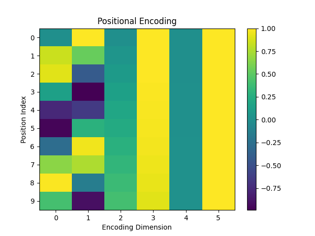

# Little More Attention - Mechanism
## Attention is all you need, the architecture


What is positional encoding and Why it is so important?
> Given in the architecture we see that input embedding is added to positional encoding vector.
> Let's discussed what value it contains?

In short, it is to maintain the order of the order of the words in the input sequence.
The positional encoding mechanism described in the text is crucial for Transformer models to understand the order of tokens in a sequence. Here's a breakdown of how it works:
 
> Note: we cannot fill any random value to the vector. If we try to fill number between 1 -> seq_len then the numbers could get quite large
> , while training our model can face sentences longer than the ones in training
> Neither its a  good idea to normalize it because the position should remain intact irrespective to total length or any other factor.

1.  Purpose: Since Transformer models lack recurrence and convolution, they need a mechanism to understand the sequential order of tokens. Positional encodings are added to the input embeddings to provide this positional information.
2.  Dimensionality: The positional encodings have the same dimension as the embeddings, so they can be directly added to the embeddings. This ensures that the model can utilize positional information effectively.
3.  Encoding Method: The positional encodings are computed using sine and cosine functions of different frequencies. Each dimension of the positional encoding corresponds to a sinusoid.

## But why sin and cosine?

1. Periodicity
    1. The sine and cosine function are periodic function meaning they repeat
2. To give a bounded region
3. Extrapolate to long sequences.
4. Difference in frequency height(d_model dimension) helps to resolve order conflict.
5. 
   


$\psi'(w_t) = \psi(w_t) + \vec{p}_t$


For each word `w_t` in a sentence `[w_1, ..., w_n]`, you calculate the modified embedding `ψ'(w_t)` as follows:

1. **Initial Word Embedding**: Obtain the initial embedding of the word `w_t` denoted by `ψ(w_t)`. This initial embedding represents the word's semantic meaning in a vector space.

2. **Modification Vector**: Add a modification vector `→p_t` to the initial embedding `ψ(w_t)`. This modification vector can be context-dependent or task-specific and is used to adjust the word embedding based on additional information or requirements of the model.

3. **Final Embedding**: The modified embedding `ψ'(w_t)` is obtained by adding the modification vector `→p_t` to the initial embedding `ψ(w_t)`:



Here is the code for positional encoding in PyTorch:

```
class PositionalEncoding(nn.Module):  
    def __init__(self, num_hiddens, dropout, max_len=1000):
        super().__init__()
        self.dropout = nn.Dropout(dropout)
        # Create a long enough P
        self.P = torch.zeros((1, max_len, num_hiddens))
        X = torch.arange(max_len, dtype=torch.float32).reshape(
            -1, 1) / torch.pow(10000, torch.arange(
            0, num_hiddens, 2, dtype=torch.float32) / num_hiddens)
        self.P[:, :, 0::2] = torch.sin(X)
        self.P[:, :, 1::2] = torch.cos(X)

    def forward(self, X):
        X = X + self.P[:, :X.shape[1], :].to(X.device)
        return self.dropout(X)

```

Reference links:
[Links](https://kazemnejad.com/blog/transformer_architecture_positional_encoding/)
[Links](https://blog.timodenk.com/linear-relationships-in-the-transformers-positional-encoding/)

# Knowing Self Attention, Attention!


### Visualizing attetnion, on its diagonal the attention will be high because it is itneratcting with itself,
