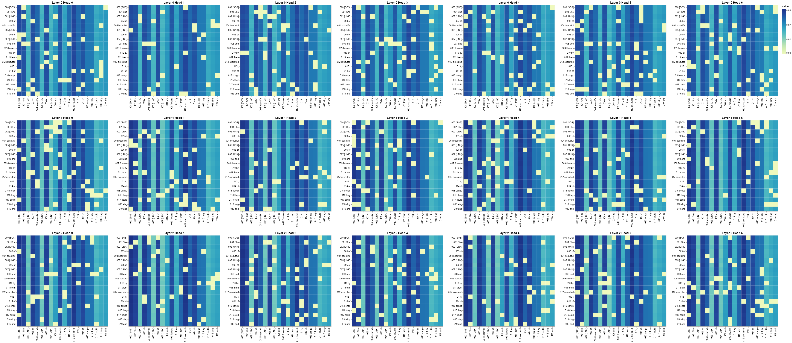
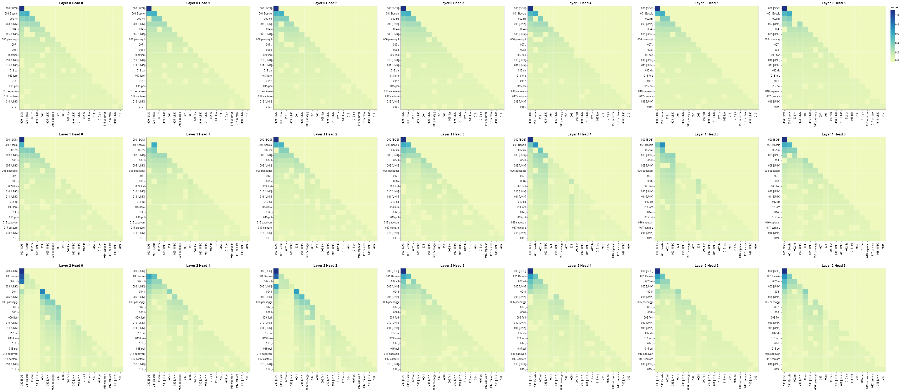
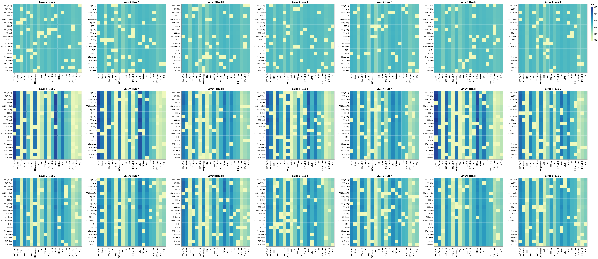

## Transformer translation project From Scratch

- Run the script in colab, with [TRANSLATION NOTEBOOK](https://github.com/AIsquare/Transformer-From-scratch/tree/main/translation).
- For convenience I have exploited the architecture so that it could run in colab if you have compute you can run it in local.
- Though I din't ran it for lot of epochs, the models hasn't spit out anything good.
- But surely on positional encoding it has learned something.

 > pip install -r requirements.txt

```

├── 📁 Models
│ 
├── 📄 config.py
├── 📄 dataset.py
├── 📄 main.py
├── 📄 temp.py
├── 📄 tokenizer_en.json
├── 📄 tokenizer_it.json
├── 📄 train.py
├── 📄transformer_tranlation.ipynb
├── 📄requirements.txt

```
### Encoder Positional encoding

### Decoder Positional encoding

### Encoder-decoder positional encoding


